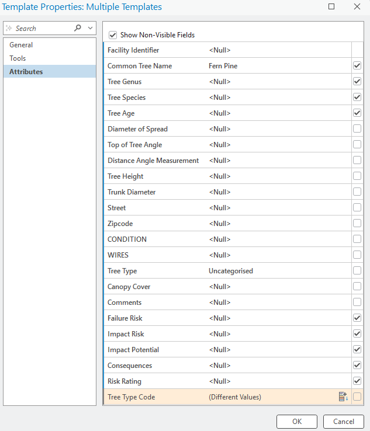

# Feature Template Configuration

## Overview

This project demonstrates configuring feature templates in ArcGIS Pro to streamline data entry and maintain consistent attribute values during feature editing.

## Skills Demonstrated

- ArcGIS Pro
- Feature Templates
- Attribute Configuration
- Geodatabase Editing
- Data Quality Management

## Feature Template Configuration

